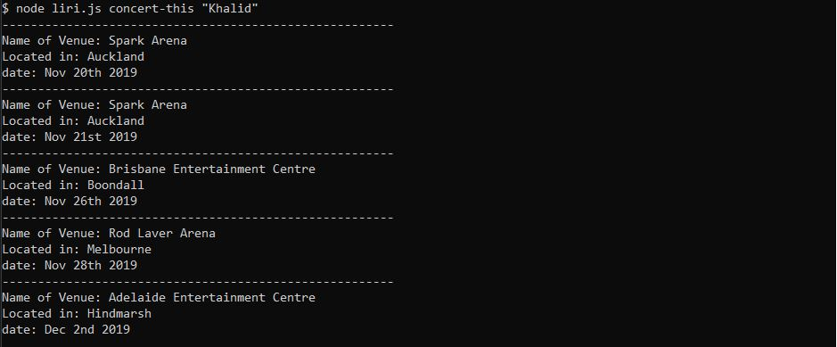
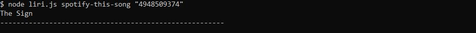
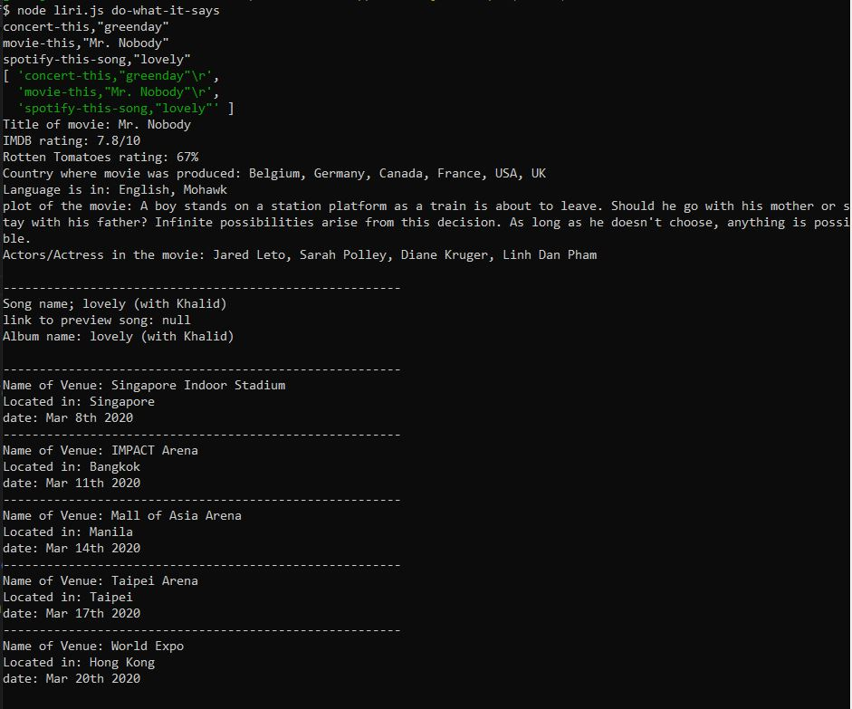

# liri-node-app
Liri is an application that will search for concerts, songs, and movies!
If you want to search what town your favorite concert is going to be in you can by typing into the command line "node liri.js concert-this 'name of artist'" and it will provide you the name of the venue they are playing at, location, and date. Here is a screenshot of that:

Another awesome command liri can do is look up movies! Liri will tell you the title of the movie, IMDB rating, Rotten Tomatoes rating, Country where it was produced, languages it is in, plot and actors/actress in the movie. You can run "node liri.js movie-this "Movie Name"

Liri can also pull up songs, a preview link to the song and provide the album name. You would type "node liri.js spotify-this-song 'name of song'" Heres an example of that!

If you type a song that does not exist it will say "The Sign" instead.

And the final command it takes is "do-what-it-says" this will run the command "do-what-it-says" and run multiple strings located in my file random.txt, separted by new lines. Here is an example of what that looks like!

